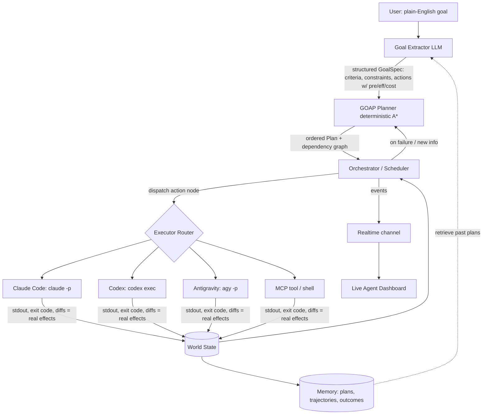

# 05 — Self-Hosted GOAL Generator: Build Blueprint

> An architecture/design spec for a self-hosted system that turns a plain-English goal into a GOAP plan and **dispatches each action to your own coding-agent subscriptions** (Claude Code, Codex, Antigravity/Gemini), with replanning on failure. This is a design, not code (per the agreed scope of this pass).

**Related:** [`01-goap-fundamentals.md`](01-goap-fundamentals.md) · [`02-goal-oriented-planning-in-llm-agents.md`](02-goal-oriented-planning-in-llm-agents.md) · [`03-goal-ruv-io-analysis.md`](03-goal-ruv-io-analysis.md) · [`06-fork-vs-build-decision.md`](06-fork-vs-build-decision.md)

---

## 1. What we're building (and how it differs from `goal.ruv.io`)

A self-hosted web app where you:

1. Type a goal in plain English ("ship the auth refactor with tests and a PR").
2. An **LLM extracts** success criteria, constraints, and a **dynamic action graph** (actions with preconditions/effects/costs) — *not* a fixed template.
3. A **deterministic A\* planner** orders the actions into a valid, lowest-cost plan and renders it as an inspectable **plan tree**.
4. An **orchestrator dispatches each action node to a real executor** — your `claude -p`, `codex exec`, or `agy -p` subscription, an MCP tool, or a shell command — running independent branches in parallel.
5. The **actual result** of each action (exit code, test output, diff) becomes ground-truth world state; on failure or new info the planner **re-runs A\* from the current state** (true adaptive replanning).
6. A **live dashboard** shows real agent telemetry (role, current action, tokens/cost, status) over a realtime channel.

**The two things this adds over the shipped `goal.ruv.io` (which are exactly its unbuilt roadmap):** (a) **LLM-extracted dynamic action graphs** instead of a 7-step template, and (b) a **real execution + telemetry layer** instead of a `setTimeout` mock. See [doc 03](03-goal-ruv-io-analysis.md).

---

## 2. Architecture at a glance



**Six layers:**

| Layer | Responsibility | Deterministic or LLM |
|---|---|---|
| **Goal Extractor** | NL goal → `GoalSpec` (goal predicates, constraints, candidate actions with pre/eff/cost) | LLM |
| **Planner** | `GoalSpec` + current world state → ordered, valid, lowest-cost plan + dependency graph | **Deterministic (A\*)** |
| **Orchestrator/Scheduler** | Walk the plan, dispatch nodes (parallel where independent), collect real effects, trigger replanning | Deterministic control + LLM only for replanning decisions |
| **Executor layer** | Run an action via a chosen backend (Claude Code / Codex / Antigravity / MCP / shell) | LLM *inside* each executor; the dispatch is deterministic |
| **Memory** | Persist plans, trajectories, outcomes; retrieve similar past plans | Vector + relational |
| **Realtime/Telemetry + UI** | Stream agent/plan events to the dashboard; render the plan tree | Deterministic |

This is the **Plan-and-Execute / "GOAP node in an agent graph"** pattern from [doc 02 §5(D)](02-goal-oriented-planning-in-llm-agents.md): symbolic planner for the skeleton, LLM for authoring actions and executing steps.

---

## 3. Data model

```ts
// A fact set describing "what is true now". Keep it small and goal-relevant (Orkin's principle).
type WorldState = Record<string, boolean | number | string>;

// One atomic operator. Authored by the LLM goal-extractor, ordered by the planner.
interface Action {
  id: string;
  name: string;                 // human label, e.g. "Run test suite"
  cost: number;                 // steers A*; can encode time/$/risk
  preconditions: Partial<WorldState>;
  effects: Partial<WorldState>; // the *intended* effect; real effect comes from execution
  executor: ExecutorKind;       // 'claude-code' | 'codex' | 'antigravity' | 'mcp' | 'shell'
  payload: {                    // what to actually run
    prompt?: string;            // for agent executors
    command?: string;           // for shell
    mcpTool?: { name: string; args: unknown };
    repoPath?: string;
    permissionMode?: string;    // e.g. plan | acceptEdits | auto
  };
  verify: {                     // REQUIRED ground-truth check that the effect was achieved
    command?: string;           // e.g. "npm test" — exit 0 == effect satisfied
    successPredicate?: Partial<WorldState>;
  };
}

interface GoalSpec {
  goalText: string;
  goalState: Partial<WorldState>;   // the predicate(s) to satisfy = "definition of done"
  constraints: string[];            // budget, no force-push, must keep CI green, etc.
  initialState: WorldState;
  actions: Action[];                // candidate action pool (LLM-authored; append-only across re-extractions)
  completionPolicy: 'verify-only' | 'verify+signoff' | 'operator-defined'; // how "done" is judged
}

// canonical PlanStep references actions by id (see .claude/specs/planner.md)
interface PlanStep { actionId: string; status: 'pending'|'active'|'done'|'failed'|'skipped'; dependsOn: string[]; }
interface Plan { id: string; steps: PlanStep[]; totalCost: number; createdFromState: WorldState; }

interface AgentRun {            // one execution of one action node
  id: string; planId: string; actionId: string;
  executor: ExecutorKind;
  startedAt: string; endedAt?: string;
  status: 'running'|'succeeded'|'failed'|'cancelled';
  stdout?: string; exitCode?: number; diffRef?: string;
  tokens?: number; costUsd?: number;   // parsed from --output-format json where available
}
```

---

## 4. The planner (deterministic core)

Keep this small and boring — it's the part that gives you guarantees. You can lift `goapPlanner.ts` from `goal_ui` (MIT) almost verbatim and generalize it from booleans to typed predicates.

- **Search direction:** **forward (progressive) A\*** over the candidate action pool. For the small, mostly-linear action sets a goal generator produces, forward search is simpler and more debuggable than backward (see [doc 01 §4.3](01-goap-fundamentals.md)) — and it's what `goal.ruv.io` uses successfully.
- **g(n)** = sum of action costs; **h(n)** = count of unmet goal predicates; **f = g + h**; open/closed lists keyed by a serialized state.
- **Optimality note:** the unmet-predicate heuristic is admissible when each action satisfies ≤1 new goal predicate. If your LLM emits actions with multiple effects, either accept "good not provably-optimal" plans or switch to breadth-first for guaranteed-shortest. Document which you chose.
- **Replanning:** when an `AgentRun` fails or its verify check changes the world state unexpectedly, recompute the plan with `planner.plan(currentWorldState, goalSpec)` from the *new* state. Record the replan as a new `Plan` linked to the old one (so the UI can show "blocked branch → replanned").
- **Termination/guardrails (the AutoGPT lesson, [doc 02 §1.5](02-goal-oriented-planning-in-llm-agents.md)):** hard caps on replans, total cost (`max_budget_usd`), wall-clock, and per-action retries; loop detection (same failing action twice → escalate to human).

---

## 5. The Goal Extractor (LLM)

A single structured LLM call (forced JSON / tool-calling, exactly like `goal.ruv.io`'s edge functions) that returns a `GoalSpec`. Prompt it to:

1. Restate the goal as one or more **goal predicates** (the definition of done).
2. List **constraints** (budget, "tests must pass," "open a PR not a direct push," allowed paths).
3. Propose a **candidate action pool**, each with `name`, `preconditions`, `effects`, `cost`, a recommended `executor`, and a `verify` check.
4. Optionally retrieve **similar past plans** from memory and adapt them (the "gets smarter over time" property — real this time, via pgvector/RuVector).

This is the step that realizes what `goal.ruv.io` only mocks: a **dynamic** action graph per goal, not a fixed template. Validate the returned JSON against the `GoalSpec` schema (zod) before planning; reject/repair malformed actions.

---

## 6. The execution layer (the part that makes it *real*)

A uniform `Executor` interface with one implementation per backend. Each maps an action node to a **headless CLI invocation on the host**, captures stdout + exit code as the **real** effect (ground truth), and parses tokens/cost where available.

```ts
interface Executor {
  kind: ExecutorKind;
  run(action: Action, ctx: RunContext): Promise<AgentRun>;
}
```

| Executor | Invocation (verify exact flags against current docs) | Auth = your subscription |
|---|---|---|
| **Claude Code** | `claude -p "<prompt>" --output-format json [--permission-mode plan\|acceptEdits] [--allowedTools …]` — reads stdin, writes stdout; `--output-format json` includes `total_cost_usd` | Max/Team subscription covers headless under the same rate limit; or set `ANTHROPIC_API_KEY` for sustained parallelism ([Claude Code headless docs](https://code.claude.com/docs/en/headless)) |
| **Codex** | `codex exec "<prompt>"` (non-interactive); `codex cloud exec --attempts N` for best-of-N | `codex login` uses your ChatGPT plan; API key recommended for heavy CI/CD ([Codex CLI](https://developers.openai.com/codex/cli) · [auth](https://developers.openai.com/codex/auth)) |
| **Antigravity (Gemini)** | `agy -p "<prompt>" --output-format <fmt>`; supports async background subagents | `agy` login uses your Google AI Pro/Ultra plan. **Target `agy`, not `gemini` — Gemini CLI is retired for Pro/Ultra as of 2026-06-18** ([transition notice](https://developers.googleblog.com/an-important-update-transitioning-gemini-cli-to-antigravity-cli/)) |
| **MCP tool / shell** | direct MCP call or `child_process` exec | n/a |

**Key design points:**

- **The host is the auth boundary.** These CLIs authenticate locally (their own login), not via browser OAuth you embed in the web app. So your orchestrator process runs on a machine where you've logged each CLI in once; it spawns them as subprocesses. (See [doc 06 §3](06-fork-vs-build-decision.md) for why this matters and how to operate it.)
- **Ground-truth effects.** Don't trust the LLM's claimed effect — run the action's `verify.command` (e.g. `npm test`) and set world-state predicates from the **exit code / output**. This is the compiler/test "precondition-effect oracle" the LLM lacks ([doc 02 §6](02-goal-oriented-planning-in-llm-agents.md)).
- **Parallelism by dependency graph.** Independent plan branches run concurrently (bounded pool); dependent steps wait. This is the orchestrator-worker pattern; remember Anthropic's caveat that most coding tasks parallelize poorly and cost ~15× tokens — gate parallel fan-out behind the dependency graph and a budget.
- **Isolation.** Run each agent executor in its own git worktree so agents don't stomp each other (the Codex "don't let two threads edit the same files" rule). Worktrees are **collision-avoidance, not a security sandbox** — in v1 the host LXC/VM is the blast radius; add a **per-run container at M2** for real in-host isolation.
- **Cancellation.** Every `AgentRun` is killable (the dashboard's "kill runaway worker"); propagate SIGTERM to the subprocess.

---

## 7. Memory, telemetry, persistence

- **Persistence:** relational tables for `GoalSpec`, `Plan`, `PlanStep`, `AgentRun` (so plans/trajectories survive — unlike the stateless demo).
- **Memory (the "smarter over time" feature):** embed past `GoalSpec`+outcome and store in **pgvector** (simplest self-hosted) or **RuVector** (if you want the ruvnet graph-RAG engine, [doc 04 §3](04-ruvnet-ecosystem-evaluation.md)). The goal-extractor retrieves the top-K similar past plans and adapts them.
- **Telemetry:** a realtime channel (WebSocket/SSE, or Supabase Realtime if you adopt Supabase) emitting `PlanGenerated`, `StepStarted`, `StepCompleted`, `StepFailed`, `Replanned`, `RunMetrics` events. The dashboard subscribes and renders the plan tree + agent cards from **real** events.

---

## 8. Recommended stack (best-fit)

**Recommendation: TypeScript end-to-end.**

| Layer | Recommended | Why |
|---|---|---|
| **Frontend** | **React + Vite + Tailwind + shadcn/ui** | Lift `goal_ui`'s MIT components (plan tree, state cards, config panel) → biggest head start; matches the reference; excellent DX. |
| **Planner** | **TypeScript** (port `goapPlanner.ts`, generalized) | Small, deterministic, shared types with the rest of the stack. |
| **Orchestrator/API** | **Node** (Hono or Fastify) | Spawning headless CLIs is `child_process` — Node does this cleanly; the **Claude Agent SDK** (TS) and Codex SDK are first-class here; one language across the stack. |
| **DB / persistence** | **Postgres + pgvector** (self-hosted) | Simple, self-owned, gives relational + vector in one engine. |
| **Realtime** | **WebSocket/SSE** (or self-hosted **Supabase** for Realtime+Auth+Edge batteries) | Live telemetry; Supabase is the "matches the reference and saves time" option if you want auth+realtime+functions out of the box and are OK self-hosting it. |
| **Executors** | host-installed `claude`, `codex`, `agy` CLIs | Use your subscriptions; see §6. |

**Why not the alternatives:**
- *Mirror ruv.io exactly (Supabase Edge Functions for everything):* great for the demo's research use-case, but Deno edge functions are a poor place to spawn long-running CLI subprocesses and manage parallel agent worktrees. Keep Supabase (optionally) for DB/auth/realtime; put the orchestrator in a normal Node service.
- *Python (FastAPI):* perfectly viable — choose it if you/your team prefer Python or want the **Python** Claude Agent SDK. Trade-off: you can't directly reuse `goal_ui`'s TS planner/UI, and you'll bridge TS frontend ↔ Python backend. Recommended only if Python is a strong preference.

> If your priority is *shipping fast and staying close to the reference*, self-hosted Supabase + the TS stack above is the lowest-friction path. If your priority is *full ownership and minimal moving parts*, Node + Postgres/pgvector + a thin WebSocket server.

---

## 9. API surface (minimal)

```
POST /goals            { goalText }              -> { goalSpecId, goalSpec }      # runs Goal Extractor
POST /goals/:id/plan   { }                       -> { plan }                      # runs A* planner
POST /plans/:id/run    { mode: auto|step }       -> { runId } (+ realtime events) # orchestrate execution
POST /runs/:id/cancel                            -> { ok }                        # kill a worker
GET  /plans/:id                                  -> { plan, steps, runs }
WS   /stream/:planId                             -> PlanGenerated | StepStarted | StepCompleted | StepFailed | Replanned | RunMetrics
```

---

## 10. Phased build plan

**Phase 0 — Reference run.** Clone `goal_ui`, run it locally, read `goapPlanner.ts` and the edge functions end-to-end. Stand up RuFlo (`claude-flow`) in a sandbox to see the `goal-planner` skill behave. *Outcome: shared mental model.* ([doc 03](03-goal-ruv-io-analysis.md), [doc 04](04-ruvnet-ecosystem-evaluation.md))

**Phase 1 — Planner + dynamic extraction (no real agents yet).** Port/ generalize the A\* planner; build the Goal Extractor LLM call returning a validated `GoalSpec`; render the plan tree. Execute steps as **dry-run stubs**. *Outcome: real GOAP plans from arbitrary goals — already beyond the shipped demo.*

**Phase 2 — One real executor.** Implement `ClaudeCodeExecutor` (`claude -p … --output-format json`), ground-truth verify via test/command exit codes, real world-state updates, and **real replanning** on failure. *Outcome: a goal actually gets done by a real agent, end to end.*

**Phase 3 — Multi-executor + parallelism + telemetry.** Add `CodexExecutor` and `AntigravityExecutor`; per-action executor routing; dependency-graph parallelism with worktree isolation and budgets; the realtime dashboard with **real** agent cards and cancellation. *Outcome: the "live agent swarm" the demo only mocks.*

**Phase 4 — Memory + polish.** pgvector (or RuVector) plan/trajectory memory + retrieval-augmented goal extraction; auth; persistence/history; cost dashboards; MCP-tool actions. *Outcome: it gets smarter over time and is operable.*

---

## 11. Top risks & mitigations

| Risk | Mitigation |
|---|---|
| Runaway loops / cost (the AutoGPT failure mode) | Hard caps: max replans, `max_budget_usd`, wall-clock, per-action retries; loop detection → human escalation. |
| LLM emits invalid/over-broad actions | Validate `GoalSpec` against schema (zod); cap action count; require a `verify` check per action; sandbox execution. |
| Parallel agents corrupt the repo | One git worktree/container per agent; never two writers on the same files; merge gates. |
| Subscription auth / rate limits on the host | One logged-in host; respect each tool's rate limit; fall back to API keys for sustained parallel load; track `total_cost_usd`. |
| Over-adopting RuFlo's footprint | Reuse narrowly (UI, planner, methodology); don't pull the whole 314-tool platform unless needed ([doc 04](04-ruvnet-ecosystem-evaluation.md)). |
| Fast-moving CLI flags | Treat §6 invocations as patterns; verify exact flags against current vendor docs before shipping. |
